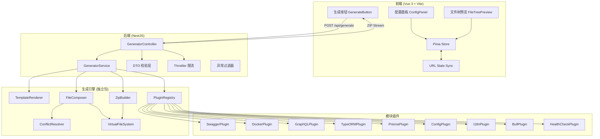
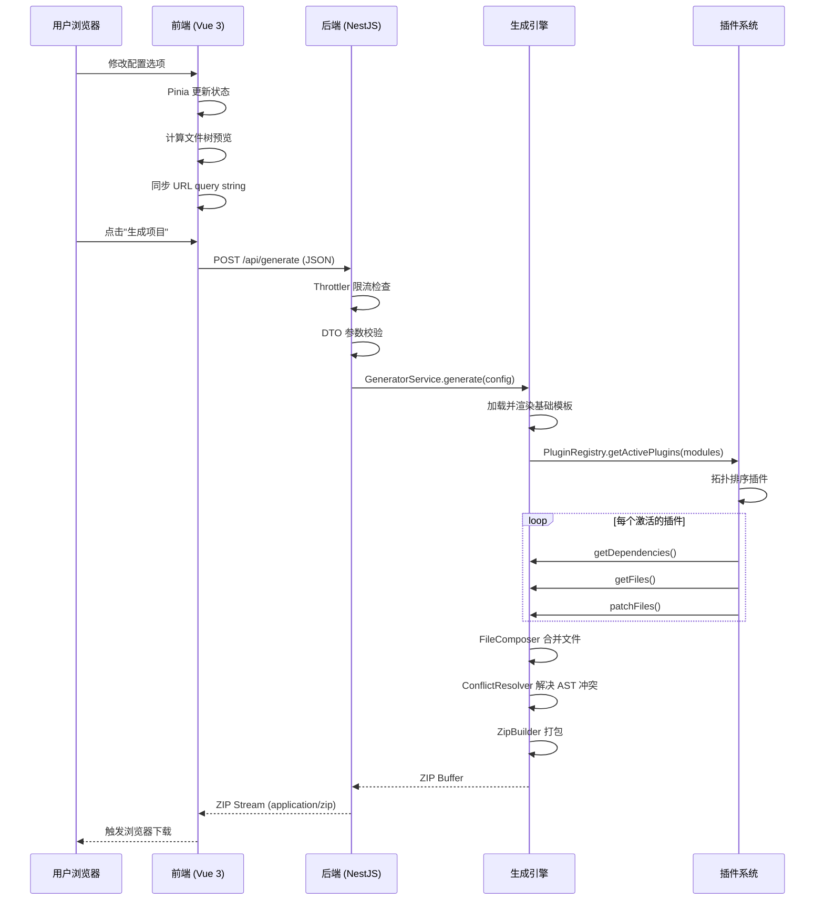
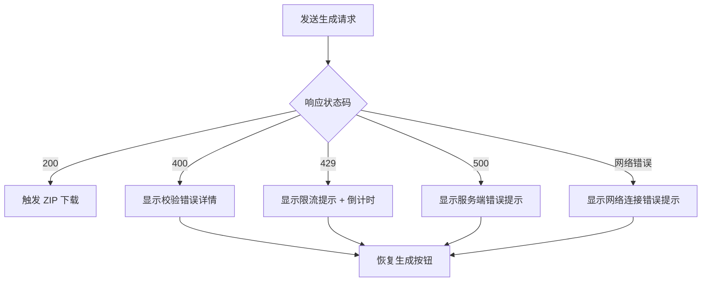

# 设计文档

## 概述

NestJS Initializr 是一个 Web 端项目脚手架生成工具，采用前后端分离的 Monorepo 架构。前端提供可视化配置面板和实时文件树预览，后端通过 RESTful API 接收配置、校验参数、调用生成引擎，最终以流式方式返回 ZIP 压缩包。

系统核心是一个基于插件架构的代码生成引擎：通过 Handlebars 模板渲染基础项目文件，通过模块插件系统注入可选功能（Swagger、Docker、GraphQL 等），通过 ts-morph 进行 AST 级别的文件合并，最终在 memfs 虚拟文件系统中组装并打包为 ZIP。

### 关键设计决策

| 决策 | 选择 | 理由 |
|------|------|------|
| Monorepo 结构 | pnpm workspaces + Turborepo | 前后端共享类型定义，生成引擎可独立测试 |
| 前端框架 | Vue 3 + TypeScript | 组合式 API 简洁高效，SFC 开发体验好 |
| 前端 UI 库 | Element Plus | 企业级组件库，开箱即用，与 Vue 3 深度集成 |
| 前端状态管理 | Pinia + URL state | Vue 3 官方推荐状态管理，天然支持配置 URL 分享 |
| 模板引擎 | Handlebars | 逻辑与模板分离，语法简洁，社区成熟 |
| 文件系统 | memfs（内存虚拟文件系统） | 零磁盘 IO，支持高并发，无需清理 |
| AST 操作 | ts-morph | 安全地修改 TypeScript 文件，避免字符串拼接 |
| 插件排序 | 拓扑排序 | 自动解析依赖关系，确保执行顺序正确 |

---

## 架构

### 系统架构图



### 数据流序列图



### 分层架构

系统采用三层架构，各层职责清晰分离：

1. **表现层（前端）**：用户交互、配置状态管理、文件树预览计算、URL 序列化/反序列化
2. **API 层（后端）**：请求路由、DTO 校验、限流保护、错误处理、ZIP 流式响应
3. **引擎层（生成引擎）**：模板渲染、插件编排、文件合并、冲突解决、ZIP 打包

---

## 组件与接口

### 前端组件

前端采用 Vue 3 + TypeScript 的 SFC（`<script setup>`）开发模式，使用 Element Plus 作为 UI 组件库，Tailwind CSS 辅助自定义样式。

#### ConfigPanel（配置面板）

负责渲染所有配置选项并收集用户输入。使用 Element Plus 表单组件。

```
<!-- Vue 3 SFC 组件结构 -->
ConfigPanel.vue
├── BasicConfig.vue        // 项目名称（ElInput）、描述（ElInput）、适配器（ElSelect）、包管理器（ElSelect）
├── QualityConfig.vue      // Lint 工具（ElSelect）、测试框架（ElSelect）、Git Hooks（ElSelect）
└── ModuleSelector.vue     // 可选功能模块多选（ElCheckboxGroup + ElCheckbox）
```

#### FileTreePreview（文件树预览）

根据当前配置状态计算并展示文件树。纯前端计算，不依赖后端 API。使用 Element Plus 的 ElTree 组件展示。

```typescript
interface FileTreeNode {
  label: string;
  type: 'file' | 'directory';
  children?: FileTreeNode[];
  /** 标记该文件由哪个模块引入，null 表示基础文件 */
  source: string | null;
}
```

#### Pinia Store

```typescript
// stores/projectConfig.ts
export const useProjectConfigStore = defineStore('projectConfig', () => {
  const config = ref<ProjectConfig>({
    name: '',
    description: '',
    adapter: HttpAdapter.Express,
    packageManager: PackageManager.Npm,
    linter: LinterOption.EslintPrettier,
    testRunner: TestRunner.Jest,
    gitHooks: GitHooksOption.None,
    modules: [],
    databaseType: undefined,
  });

  function setName(name: string): void;
  function setDescription(desc: string): void;
  function setAdapter(adapter: HttpAdapter): void;
  function setPackageManager(pm: PackageManager): void;
  function setLinter(linter: LinterOption): void;
  function setTestRunner(runner: TestRunner): void;
  function setGitHooks(hooks: GitHooksOption): void;
  function toggleModule(module: ModuleId): void;
  function setDatabaseType(db: DatabaseType): void;
  /** 从 URL query string 还原配置 */
  function restoreFromUrl(params: URLSearchParams): void;
  /** 序列化为 URL query string */
  function toQueryString(): string;

  return {
    config,
    setName, setDescription, setAdapter, setPackageManager,
    setLinter, setTestRunner, setGitHooks, toggleModule,
    setDatabaseType, restoreFromUrl, toQueryString,
  };
});
```

### 后端组件

#### GeneratorController

```typescript
@Controller('api')
class GeneratorController {
  @Post('generate')
  @UseGuards(ThrottlerGuard)
  async generate(
    @Body() dto: GenerateProjectDto,
    @Res() res: Response,
  ): Promise<void>;
}
```

#### GenerateProjectDto

```typescript
class GenerateProjectDto {
  @IsString()
  @Matches(/^[a-z0-9][a-z0-9._-]*$/)
  @Length(1, 214)
  name: string;

  @IsOptional()
  @IsString()
  @MaxLength(500)
  description?: string;

  @IsEnum(HttpAdapter)
  adapter: HttpAdapter;

  @IsEnum(PackageManager)
  packageManager: PackageManager;

  @IsEnum(LinterOption)
  linter: LinterOption;

  @IsEnum(TestRunner)
  testRunner: TestRunner;

  @IsEnum(GitHooksOption)
  gitHooks: GitHooksOption;

  @IsArray()
  @IsEnum(ModuleId, { each: true })
  modules: ModuleId[];

  @IsOptional()
  @IsEnum(DatabaseType)
  databaseType?: DatabaseType;

  @Validate(MutualExclusionConstraint, ['typeorm', 'prisma'])
  _mutualExclusion?: never;
}
```

### 生成引擎组件

#### TemplateRenderer（模板渲染器）

```typescript
interface ITemplateRenderer {
  /**
   * 渲染单个 Handlebars 模板
   * @param templatePath .hbs 模板文件路径
   * @param context 模板上下文数据
   * @returns 渲染后的文件内容
   */
  render(templatePath: string, context: Record<string, unknown>): string;

  /**
   * 批量渲染基础模板目录
   * @param config 项目配置
   * @returns 渲染后的文件映射 (路径 → 内容)
   */
  renderBaseTemplates(config: ProjectConfig): Map<string, string>;
}
```

#### PluginRegistry（插件注册表）

```typescript
interface IPluginRegistry {
  /** 注册一个模块插件 */
  register(plugin: ModulePlugin): void;

  /** 获取指定模块 ID 列表对应的插件，按拓扑排序 */
  getActivePlugins(moduleIds: ModuleId[]): ModulePlugin[];

  /** 检测循环依赖，抛出错误或返回排序结果 */
  topologicalSort(moduleIds: ModuleId[]): ModuleId[];
}
```

#### ModulePlugin（模块插件接口）

```typescript
interface ModulePlugin {
  readonly name: string;
  readonly description: string;
  readonly requires?: string[];

  getDependencies(config: ProjectConfig): {
    dependencies: Record<string, string>;
    devDependencies: Record<string, string>;
  };

  getFiles(config: ProjectConfig): GeneratedFile[];

  patchFiles(
    vfs: VirtualFileSystem,
    config: ProjectConfig,
  ): VirtualFileSystem;
}

interface GeneratedFile {
  path: string;
  content: string;
}
```

#### FileComposer（文件合并器）

```typescript
interface IFileComposer {
  /**
   * 将基础模板文件与各插件产生的文件合并
   * 对于同一文件的多次修改，使用 ConflictResolver 进行 AST 合并
   */
  compose(
    baseFiles: Map<string, string>,
    pluginOutputs: PluginOutput[],
    config: ProjectConfig,
  ): VirtualFileSystem;
}

interface PluginOutput {
  pluginName: string;
  newFiles: GeneratedFile[];
  patches: FilePatch[];
  dependencies: Record<string, string>;
  devDependencies: Record<string, string>;
}
```

#### ConflictResolver（冲突解决器）

```typescript
interface IConflictResolver {
  /**
   * 使用 ts-morph AST 操作合并多个插件对同一 TypeScript 文件的修改
   * 主要场景：多个插件向 app.module.ts 注入 imports
   */
  resolve(
    originalContent: string,
    patches: FilePatch[],
  ): string;
}

interface FilePatch {
  pluginName: string;
  filePath: string;
  /** AST 操作类型 */
  operation: 'addImport' | 'addModuleImport' | 'addProvider' | 'addBootstrapCode';
  /** 操作参数 */
  params: Record<string, unknown>;
}
```

#### ZipBuilder（ZIP 构建器）

```typescript
interface IZipBuilder {
  /**
   * 将虚拟文件系统中的所有文件打包为 ZIP Buffer
   * @param vfs 虚拟文件系统
   * @param rootDirName ZIP 内的根目录名称（项目名称）
   */
  build(vfs: VirtualFileSystem, rootDirName: string): Promise<Buffer>;
}
```

---

## 数据模型

### 核心类型定义

```typescript
// ===== 枚举类型 =====

enum HttpAdapter {
  Express = 'express',
  Fastify = 'fastify',
}

enum PackageManager {
  Npm = 'npm',
  Yarn = 'yarn',
  Pnpm = 'pnpm',
}

enum LinterOption {
  EslintPrettier = 'eslint-prettier',
  Biome = 'biome',
}

enum TestRunner {
  Jest = 'jest',
  Vitest = 'vitest',
}

enum GitHooksOption {
  None = 'none',
  Husky = 'husky',
}

enum ModuleId {
  Config = 'config',
  Swagger = 'swagger',
  GraphQL = 'graphql',
  TypeORM = 'typeorm',
  Prisma = 'prisma',
  Docker = 'docker',
  I18n = 'i18n',
  Husky = 'husky',
  Bull = 'bull',
  HealthCheck = 'health-check',
}

enum DatabaseType {
  PostgreSQL = 'postgresql',
  MySQL = 'mysql',
  SQLite = 'sqlite',
}

// ===== 项目配置 =====

interface ProjectConfig {
  name: string;
  description?: string;
  adapter: HttpAdapter;
  packageManager: PackageManager;
  linter: LinterOption;
  testRunner: TestRunner;
  gitHooks: GitHooksOption;
  modules: ModuleId[];
  databaseType?: DatabaseType;
}

// ===== 虚拟文件系统 =====

interface VirtualFileSystem {
  /** 获取文件内容 */
  get(path: string): string | undefined;
  /** 设置文件内容 */
  set(path: string, content: string): void;
  /** 检查文件是否存在 */
  has(path: string): boolean;
  /** 删除文件 */
  delete(path: string): void;
  /** 获取所有文件路径 */
  paths(): string[];
  /** 获取所有文件的路径→内容映射 */
  entries(): Map<string, string>;
}

// ===== API 响应 =====

interface ApiErrorResponse {
  statusCode: number;
  message: string | string[];
  error: string;
  /** 出错的插件名称（仅插件执行错误时） */
  pluginName?: string;
}

// ===== URL 配置参数映射 =====

interface ConfigUrlParams {
  name?: string;
  adapter?: string;
  pm?: string;
  linter?: string;
  test?: string;
  hooks?: string;
  modules?: string; // 逗号分隔
  db?: string;
}

// ===== 模块依赖关系定义 =====

const MODULE_DEPENDENCIES: Record<string, string[]> = {
  [ModuleId.GraphQL]: [ModuleId.Config],
  [ModuleId.TypeORM]: [ModuleId.Config],
  [ModuleId.Prisma]: [ModuleId.Config],
  [ModuleId.Bull]: [ModuleId.Config],
};

// ===== 互斥模块定义 =====

const MUTUAL_EXCLUSIONS: [string, string][] = [
  [ModuleId.TypeORM, ModuleId.Prisma],
];
```

### 文件树预览计算模型

```typescript
/** 基础文件列表（始终存在） */
const BASE_FILES: string[] = [
  'src/main.ts',
  'src/app.module.ts',
  'src/app.controller.ts',
  'src/app.service.ts',
  'package.json',
  'tsconfig.json',
  'README.md',
];

/** 根据配置动态计算的文件映射 */
interface FileTreeConfig {
  linterFiles: Record<LinterOption, string[]>;
  testFiles: Record<TestRunner, string[]>;
  moduleFiles: Record<ModuleId, string[]>;
}

const FILE_TREE_CONFIG: FileTreeConfig = {
  linterFiles: {
    [LinterOption.EslintPrettier]: ['.eslintrc.js', '.prettierrc'],
    [LinterOption.Biome]: ['biome.json'],
  },
  testFiles: {
    [TestRunner.Jest]: ['test/app.e2e-spec.ts', 'jest.config.ts'],
    [TestRunner.Vitest]: ['test/app.e2e-spec.ts', 'vitest.config.ts'],
  },
  moduleFiles: {
    [ModuleId.Docker]: ['Dockerfile', 'docker-compose.yml', '.dockerignore'],
    [ModuleId.Config]: ['.env.example'],
    [ModuleId.Swagger]: [],
    [ModuleId.GraphQL]: ['src/graphql/sample.resolver.ts', 'src/graphql/sample.schema.graphql'],
    [ModuleId.TypeORM]: ['src/entities/sample.entity.ts'],
    [ModuleId.Prisma]: ['prisma/schema.prisma', 'src/prisma/prisma.service.ts'],
    [ModuleId.I18n]: ['src/i18n/en/common.json', 'src/i18n/zh/common.json'],
    [ModuleId.Bull]: ['src/queues/sample.processor.ts'],
    [ModuleId.HealthCheck]: ['src/health/health.controller.ts'],
    [ModuleId.Husky]: ['.husky/pre-commit', '.lintstagedrc.json'],
  },
};
```


---

## 正确性属性

*属性（Property）是指在系统所有有效执行中都应成立的特征或行为——本质上是对系统应做什么的形式化陈述。属性是连接人类可读规格说明与机器可验证正确性保证之间的桥梁。*

### 属性 1：npm 包名校验一致性

*对于任意*字符串，项目名称校验函数应当接受当且仅当该字符串符合 npm 包命名规范（小写字母、数字、连字符、下划线，长度 1-214，以小写字母或数字开头）的字符串；对于不符合规范的字符串应当拒绝。

**验证需求：1.1, 5.1**

### 属性 2：模块依赖解析完整性

*对于任意*有效的模块选择集合，经过依赖解析后的结果集合应当包含所有被选模块的全部传递依赖，且结果集合是原始选择集合的超集。

**验证需求：2.5**

### 属性 3：基础文件不变量

*对于任意*有效的 ProjectConfig 配置组合，计算得到的文件树应当始终包含基础项目文件（src/main.ts、src/app.module.ts、src/app.controller.ts、src/app.service.ts、package.json、tsconfig.json、README.md）。

**验证需求：3.4**

### 属性 4：项目名称传播一致性

*对于任意*有效的项目名称，生成引擎产出的 ZIP 应满足：(a) ZIP 内根目录名称与项目名称一致，(b) package.json 的 name 字段与项目名称一致，(c) README.md 内容包含项目名称。

**验证需求：4.4, 4.5, 4.7**

### 属性 5：DTO 模块标识符校验

*对于任意*字符串数组，DTO 校验应当接受当且仅当数组中每个元素都是预定义的合法 ModuleId 枚举值之一；包含任何非法值的数组应当被拒绝。

**验证需求：5.6**

### 属性 6：配置 URL 序列化往返一致性

*对于任意*有效的 ProjectConfig，将其序列化为 URL query string 后再反序列化，应当得到与原始配置等价的 ProjectConfig 对象。

**验证需求：6.1, 6.2, 6.5**

### 属性 7：无效 URL 参数默认值回退

*对于任意*包含无法识别参数值的 URL query string，反序列化时应当对无效参数使用对应配置项的默认值，且不抛出异常。

**验证需求：6.4**

### 属性 8：插件接口契约

*对于任意*已注册的 ModulePlugin 和任意有效的 ProjectConfig，调用 getDependencies 应返回包含 dependencies 和 devDependencies 两个键的对象（值为 Record<string, string>），调用 getFiles 应返回 GeneratedFile 数组（每个元素包含非空 path 和 content），调用 patchFiles 应返回有效的 VirtualFileSystem。

**验证需求：7.2, 7.3, 7.4**

### 属性 9：拓扑排序顺序不变量

*对于任意*模块选择集合，插件注册表的拓扑排序结果应满足：对于结果中的每个插件，其所有依赖插件都出现在它之前。

**验证需求：7.5**

### 属性 10：插件执行范围限定

*对于任意*模块选择集合，生成引擎实际执行的插件集合应当恰好等于用户选中的模块及其传递依赖对应的插件集合，不多不少。

**验证需求：7.7**

### 属性 11：app.module.ts 基础导入不变量

*对于任意*有效的 ProjectConfig 配置组合，生成的 app.module.ts 文件应当始终包含 AppController 和 AppService 的导入声明和模块注册。

**验证需求：8.10**

### 属性 12：模板路径后缀转换

*对于任意*以 .hbs 结尾的模板文件路径，模板渲染器输出的目标文件路径应当为去除 .hbs 后缀后的路径。

**验证需求：20.1**

### 属性 13：有效配置生成有效 TypeScript

*对于任意*有效的 ProjectConfig 配置组合，生成引擎产出的所有 .ts 文件应当是语法正确的 TypeScript（可通过 AST 解析验证）。

**验证需求：20.3**

### 属性 14：模板渲染无 undefined 泄漏

*对于任意*有效的 ProjectConfig 配置组合，生成引擎产出的所有文件内容中不应包含 "undefined" 字面量字符串。

**验证需求：20.4**

### 属性 15：ZIP 打包往返一致性

*对于任意*虚拟文件系统中的文件集合，经 ZipBuilder 打包后再解压，应当得到与原始文件集合相同的目录层级结构和文件内容。

**验证需求：21.2, 21.3**

---

## 错误处理

### 错误分类与处理策略

| 错误类型 | HTTP 状态码 | 处理策略 | 响应格式 |
|----------|------------|----------|----------|
| DTO 校验失败 | 400 | ValidationPipe 自动捕获，返回字段级错误详情 | `{ statusCode: 400, message: [...], error: "Bad Request" }` |
| 互斥配置冲突 | 400 | 自定义 Validator 检测，返回冲突说明 | `{ statusCode: 400, message: "TypeORM 和 Prisma 不能同时选择", error: "Bad Request" }` |
| 请求限流 | 429 | @nestjs/throttler 自动处理 | `{ statusCode: 429, message: "Too Many Requests" }` + `Retry-After` 响应头 |
| 模板渲染错误 | 500 | 捕获 Handlebars 编译/渲染异常 | `{ statusCode: 500, message: "模板渲染失败: [错误类型]", error: "Internal Server Error" }` |
| 插件执行错误 | 500 | 捕获插件方法异常，附带插件名称 | `{ statusCode: 500, message: "插件执行失败", pluginName: "swagger", error: "Internal Server Error" }` |
| ZIP 打包错误 | 500 | 捕获 archiver 异常 | `{ statusCode: 500, message: "ZIP 打包失败", error: "Internal Server Error" }` |

### 全局异常过滤器

```typescript
@Catch()
class GlobalExceptionFilter implements ExceptionFilter {
  catch(exception: unknown, host: ArgumentsHost) {
    // 1. 记录完整错误堆栈到服务端日志
    // 2. 对客户端返回脱敏的错误信息（不暴露内部堆栈）
    // 3. 对 PluginExecutionError 额外返回 pluginName 字段
    // 4. 对未知异常统一返回 500 + 通用错误消息
  }
}
```

### 前端错误处理流程



---

## 测试策略

### 测试分层

```
┌─────────────────────────────────────────┐
│          E2E 测试（Playwright）           │
│  完整用户流程：配置 → 生成 → 下载 → 验证   │
└─────────────────────────────────────────┘
┌─────────────────────────────────────────┐
│         集成测试（Supertest）              │
│  API 端点：DTO 校验、限流、ZIP 响应        │
└─────────────────────────────────────────┘
┌─────────────────────────────────────────┐
│     属性测试（fast-check）                │
│  正确性属性：往返一致性、不变量、契约       │
└─────────────────────────────────────────┘
┌─────────────────────────────────────────┐
│     单元测试（Vitest）                    │
│  组件、插件、工具函数的具体行为验证         │
└─────────────────────────────────────────┘
```

### 属性测试（Property-Based Testing）

采用 **fast-check** 库进行属性测试，每个属性测试最少运行 **100 次迭代**。

每个属性测试必须以注释标注对应的设计文档属性：

```typescript
// Feature: nestjs-initializr, Property 6: 配置 URL 序列化往返一致性
fc.assert(
  fc.property(arbitraryProjectConfig, (config) => {
    const url = toQueryString(config);
    const restored = fromQueryString(new URLSearchParams(url));
    expect(restored).toEqual(config);
  }),
  { numRuns: 100 }
);
```

#### 属性测试覆盖范围

| 属性编号 | 属性名称 | 测试目标 | 生成器策略 |
|---------|---------|---------|-----------|
| 1 | npm 包名校验一致性 | 校验函数 | 随机字符串 + 合法 npm 名称生成器 |
| 2 | 模块依赖解析完整性 | 依赖解析函数 | 随机模块子集 |
| 3 | 基础文件不变量 | 文件树计算函数 | 随机 ProjectConfig |
| 4 | 项目名称传播一致性 | 生成引擎 | 随机合法项目名称 |
| 5 | DTO 模块标识符校验 | DTO 校验 | 随机字符串数组 |
| 6 | 配置 URL 往返一致性 | URL 序列化/反序列化 | 随机 ProjectConfig |
| 7 | 无效 URL 参数默认值回退 | URL 反序列化 | 随机无效参数值 |
| 8 | 插件接口契约 | 各插件方法 | 随机 ProjectConfig × 各插件 |
| 9 | 拓扑排序顺序不变量 | PluginRegistry | 随机模块子集 |
| 10 | 插件执行范围限定 | 生成引擎 | 随机模块子集 |
| 11 | app.module.ts 基础导入不变量 | 模板渲染 | 随机 ProjectConfig |
| 12 | 模板路径后缀转换 | TemplateRenderer | 随机 .hbs 文件路径 |
| 13 | 有效配置生成有效 TypeScript | 生成引擎 | 随机有效 ProjectConfig |
| 14 | 模板渲染无 undefined 泄漏 | 生成引擎 | 随机有效 ProjectConfig |
| 15 | ZIP 打包往返一致性 | ZipBuilder | 随机文件集合 |

### 单元测试

单元测试使用 **Vitest** 框架，聚焦于：

- 各模块插件的具体输出验证（需求 9-17 的验收标准）
- 基础模板渲染的具体配置组合（需求 8 的各适配器/包管理器/Lint 工具组合）
- DTO 枚举值校验（需求 5.2-5.5）
- 错误处理场景（需求 19）
- 前端组件默认值和交互行为（需求 1.3-1.7, 2.1-2.4, 2.6）：使用 Vitest + @vue/test-utils 测试 Vue 3 组件

### 集成测试

- API 端点完整请求/响应流程（Supertest）
- 限流行为验证（需求 18）
- ZIP 响应头和内容验证（需求 21.4）

### E2E 测试

- 完整用户流程：打开页面 → 配置选项 → 生成下载 → 解压验证
- 响应式布局验证（需求 22）
- URL 配置分享流程（需求 6）
