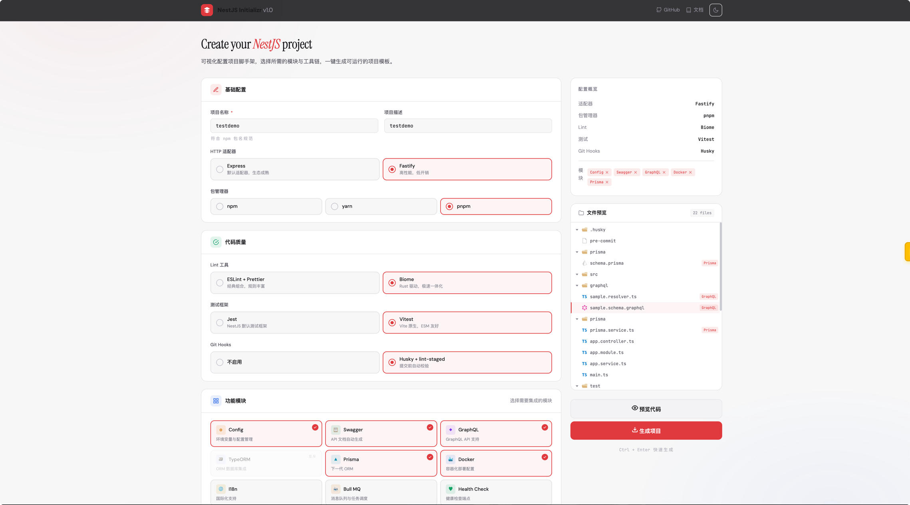
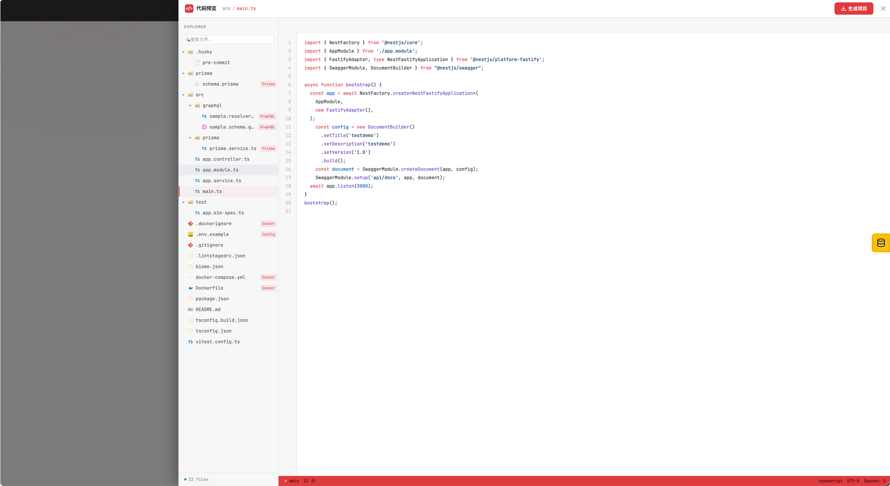

# NestJS Initializr

> 一个类似 [Spring Initializr](https://start.spring.io) 的 Web 工具，用于快速生成配置完备、开箱即用的 NestJS 项目脚手架。

把项目初始化时间从数小时缩短到数秒：可视化勾选 HTTP 适配器、包管理器、Lint 工具、测试框架、Docker、Swagger、i18n 等模块，一键生成并下载 ZIP。

🔗 **在线体验**：<http://160.202.237.14:8080>

---

## 📸 预览

**可视化配置面板**：勾选所需的技术栈和模块，右侧实时展示配置摘要与生成的文件树。

<p align="center">
  
</p>

**代码在线预览**：下载前可直接查看每个文件的完整内容（带语法高亮）。

<p align="center">
  
</p>

---

## ✨ 特性

- **可视化配置**：Web 界面勾选所有项目选项，所见即所得
- **多维组合**：HTTP 适配器（Express / Fastify）、包管理器（npm / yarn / pnpm）、测试（Jest / Vitest）、Lint（ESLint+Prettier / Biome）等自由搭配
- **模块插件化**：Swagger、Docker、GraphQL、i18n、Husky 等模块按需启用
- **文件树预览**：生成前可在线浏览即将下载的项目结构与文件内容
- **一键下载**：浏览器中直接生成 ZIP，下载即用
- **生产就绪**：内置 Docker 多阶段构建 + Nginx 部署方案

---

## 🏗️ 项目结构

Monorepo（pnpm workspace + Turborepo）：

```
.
├── apps/
│   ├── api/                # NestJS 后端：暴露生成接口、返回 ZIP 流
│   └── web/                # Vue 3 + Vite 前端：配置面板与下载交互
├── packages/
│   └── generator/          # 核心生成引擎（模板渲染 + 模块编排）
├── docker-compose.yml      # 本地构建并运行
├── docker-compose.prod.yml # 生产环境（拉取 SWR 镜像）
└── build_and_push.sh       # 构建并推送镜像到华为云 SWR
```

---

## 🛠️ 技术栈

| 层级 | 技术 |
|------|------|
| 前端 | Vue 3、Vite 6、Element Plus、Pinia、TailwindCSS、Shiki |
| 后端 | NestJS 11、Express、class-validator、Throttler |
| 生成引擎 | TypeScript、模板渲染 |
| 测试 | Vitest、fast-check（PBT 属性测试） |
| 工程化 | pnpm 10、Turborepo、TypeScript 5.8 |
| 部署 | Docker、Nginx、华为云 SWR |

---

## 🚀 本地开发

### 环境要求

- Node.js >= 20
- pnpm >= 10.15.1（推荐通过 corepack 启用）

```bash
corepack enable
corepack prepare pnpm@10.15.1 --activate
```

### 启动

```bash
# 1. 安装依赖
pnpm install

# 2. 启动全部服务（前端 + 后端 + generator watch）
pnpm dev
```

启动后：

- 前端：http://localhost:5173
- 后端：http://localhost:3000

### 常用脚本

```bash
pnpm build        # 全量构建
pnpm test         # 运行单元测试
pnpm test:pbt     # 运行属性测试
pnpm lint         # 代码检查
pnpm clean        # 清理产物
```

也可针对单个包：

```bash
pnpm --filter @nestjs-initializr/web dev
pnpm --filter @nestjs-initializr/api dev
pnpm --filter @nestjs-initializr/generator build
```

---

## 🐳 Docker 部署

### 方式 A：本地构建并运行

```bash
docker compose up -d --build
```

启动后：

- 前端：http://localhost
- 后端：http://localhost:3000

### 方式 B：从镜像仓库拉取（生产推荐）

镜像托管在华为云 SWR，使用前先登录：

```bash
docker login swr.cn-north-4.myhuaweicloud.com
```

部署：

```bash
# 启动（默认拉取 latest，宿主机端口 8080）
docker compose -f docker-compose.prod.yml up -d

# 指定版本与端口
TAG=1.0.0 WEB_PORT=8080 docker compose -f docker-compose.prod.yml up -d

# 升级
TAG=1.0.1 docker compose -f docker-compose.prod.yml up -d

# 停止
docker compose -f docker-compose.prod.yml down
```

> 默认前端暴露在宿主机 `8080`，可通过 `WEB_PORT` 环境变量自定义；若主机 80 端口空闲，可设 `WEB_PORT=80`。

### 方式 C：自动 HTTPS（Caddy 反代 + Let's Encrypt）

适合已绑定域名的生产部署，证书自动申请、自动续期，零运维。

**前置条件**：

1. 已申请域名并将 A 记录解析到本服务器公网 IP
2. 服务器已开放 `80` / `443` 端口（云厂商安全组 + 系统防火墙）

**启动**：

```bash
DOMAIN=initializr.example.com TAG=1.0.0 \
  docker compose -f docker-compose.https.yml up -d
```

启动后访问 `https://initializr.example.com` 即可，HTTP 自动跳转 HTTPS。Caddy 还启用了 HSTS、X-Frame-Options、HTTP/3 与 zstd 压缩等增强配置。

### 构建并推送镜像

```bash
./build_and_push.sh 1.0.0
```

脚本会通过 `docker buildx` 构建 `linux/amd64` 镜像，并同时推送 `1.0.0` 与 `latest` 两个 tag 到 SWR：

- `swr.cn-north-4.myhuaweicloud.com/weipengcheng/xlt-initializr-api`
- `swr.cn-north-4.myhuaweicloud.com/weipengcheng/xlt-initializr-web`

---

## 🧪 测试

项目使用 **Vitest** 做单元测试，**fast-check** 做属性测试（PBT），保证生成器在大量随机配置组合下产物的稳定性与正确性。

```bash
pnpm test          # 单元测试
pnpm test:pbt      # 属性测试
```

---

## 🐛 常见问题

**Q：`docker compose up` 报 `address already in use 0.0.0.0:80`？**

宿主机 80 端口被占用（常见于本机 nginx / 宝塔 / 1Panel）。两种解决办法：

1. 改用其他端口（推荐）：`WEB_PORT=8080 docker compose -f docker-compose.prod.yml up -d`
2. 释放 80 端口：`sudo lsof -i :80` 找到占用进程并停掉

**Q：拉取 `node:20-alpine` 镜像超时？**

Dockerfile 已使用 `docker.m.daocloud.io` 镜像加速，如仍超时可在 `apps/*/Dockerfile` 顶部修改 `NODE_IMAGE` / `NGINX_IMAGE` 为其他可用镜像源。

---

## 📄 License

[MIT](./LICENSE)
